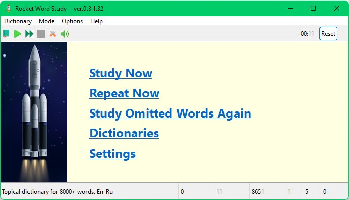
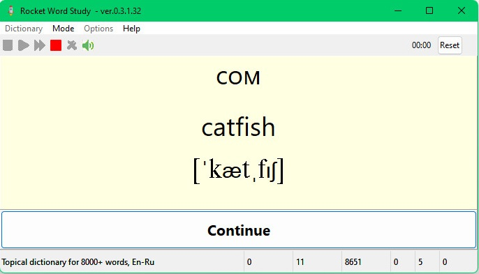
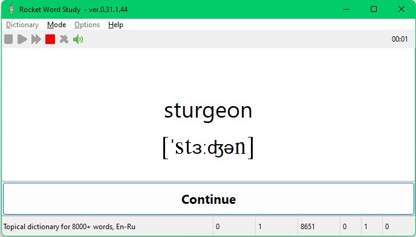
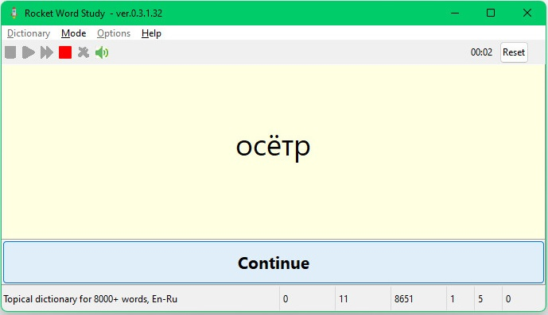
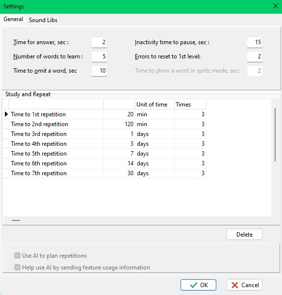
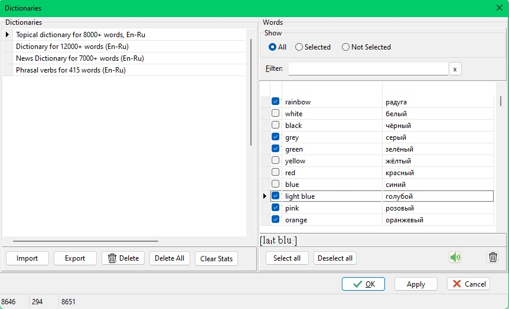

# Программа Rocket Word Study для изучения 100 слов в час

__Rocket Word Study__ — программа-конвейер, предназначенная для ускоренного изучения иностранных слов с помощью метода интервальных повторений. В основу программы положен алгоритм Николая Ягодкина изучения иностранных слов с помощью карточек "***100 слов в час***", "***1000 слов в неделю***".

Назначение программы — помочь пользователю ускоренно выучить слова до такой степени, чтобы перевод слова в обе стороны (родной — иностранный и иностранный — родной) занимал несколько секунд или даже долей секунды (что необходимо для общения), co 100% точностью, и закрепить этот навык на длительный срок (в идеале — навсегда).

__Однокнопочный интерфейс__ программы делает её уникальной, позволяя пользователю не тратить время и внимание на выбор того, какую кнопку нажать, сосредоточив все внимание на процессе изучения слов. Благодаря этому, слова запоминаются в несколько, может быть, даже в десятки, раз быстрее, чем у аналогов!

Каждое слово в программе представлено в виде виртуальных флэш-карточек 2-х видов: полная и частичная. В полной карточке слово с переводом и транскрипцией расположено на одной стороне карточки.

В частичной карточке слово с транскрипцией расположено
на одной стороне карточки, а перевод — на другой.

 

Программа имеет три режима: режимы кодирования слова, его запоминания и повторения. В режиме кодирования пользователь знакомится со словом и переводом, создает мнемонические образы для запоминания, в режиме повторения - повторяет слово и перевод по несколько раз (по умолчанию, 3 раза) в обе стороны: с родного на иностранный и с иностранного на родной.

На первоначальное запоминание (кодирование) полной флеш-карты слова дается ограниченное время (по умолчанию, 10 секунд). Если за это время пользователь не успел закодировать слово, оно помечается как "пропущенное", и программа показывает карточку следующего слова.

"Пропущенные" слова можно попытаться запомнить в следующий раз, выбрав соответствующий пункт меню.

Режим повторения состоит из этапов, "ступеней". Каждая ступень имеет свою продолжительность: от десятков минут до нескольких недель или даже месяцев. Так, первая ступень имеет свойство "продолжительность", по умолчанию, 20 минут, вторая — 2 часа, третья — один день, четвертая — 3 дня, и т.д. Количество ступеней и их  продолжительность можно настроить в настройках программы.

В режиме повторения слово показывается пользователю столько раз, сколько нужно, чтобы пользователь вспомнил перевод за определенное в настройках время (несколько секунд или даже долей секунды). Затем это слово переходит на следующую ступень и будет доступно для повторения пользователю в следующий раз через время, указанное в свойстве ступени "продолжительность", то есть, по умолчанию, соответсвенно, через 20 минут, 2 часа, один день, три дня и т.д. Если пользователь не смог вспомнить слово за время, указанное в настройках (несколько секунд или долей секунды), слово возвращается на первую ступень. Таким способом достигается длительное хранение слова в памяти ("Методика Эббингауза"). После прохождения последней ступени, слово переходит в состояние "выучено".

## Как работать с программой

После установки программы вы можете выбрать пункт меню (или кликнуть на соответствующей кнопке в тулбаре) "__Dictionary__". В открывшемся диалоговом окне вы можете выбрать словарь, слова которого хотите выучить, а также отметить галочкой те слова, которые хотите учить. Если слово уже знакомо или вы не хотите его учить, можете снять галочку с этого слова.

Затем нужно щелкнуть мышкой на кнопке "__Study Now__". Программа выберет 5-10 первых слов из словаря, который вы выбрали ранее, и будет по очереди показывать их виртуальные флеш-карточки: сначала полную, а затем частичную: три раза с родного на иностранный языки, и три раза с иностранного на родной. Для перехода от одной карточки к другой нужно кликнуть на кнопке "__Continue__".

После того, как все карточки показаны, можно продолжить изучение следующих 5-10 слов или 20 минут (именно столько имеет продолжительность первая ступень по умолчанию) заняться другими делами.

Через 20 минут вы можете включить режим повторения, кликнув на кнопке "__Repeat Now__". Вам будут показываться слова, которые вы только что учили. Если вы вспомнили перевод — нужно быстро кликнуть на кнопке "__Continue__". Тогда покажется карточка следующего слова в случайном порядке. Если не успели вспомнить слово за установленное в настройках время, тогда покажется его полная флеш-карточка, а слово перейдет, после определенного количества ошибок (также задается в настройках), на первую ступень . Вспоминать слово больше несколько секунд не имеет смысла, лучше его сразу повторить. Чем больше повторений, тем быстрее выучится слово. Если слово плохо запоминается, тогда, вероятно, вы создали плохой мнемонический образ или плохо его представили в своем воображении, и необходимо его пересоздать и закрепить в памяти.

## В чем заключается алгоритм "Антибарана"?

Пользователю дается для запоминания в первый раз полная карточка и выделяется время для кодирования слова (по умолчанию, 10 сек., время задается в настройках). Если пользователь успел закодировать слово, он нажимает кнопку "__Continue__", и слово дальше проходит все стадии изучения.

Если пользователь за 10 секунд не успел закодировать слово, программа предложит ему новое слово, а слово, которое он не смог закодировать за 10 секунд, обозначается как "пропущенное".

Когда пользователь выучит все слова, которые он смог закодировать за 10 секунд, он может вернуться к запоминанию "пропущенных" слов. Для этого в программе есть пункт меню: "__Study omitted words again__".

Видео "Алгоритм антибарана":  

<https://www.youtube.com/watch?v=YJD04mk5iMI>

___

Ссылка на установочный пакет программы:
<https://rockettech.com/rws/rws.exe>

Лицензия: свободная (MIT, open source)

Ссылка на исходный код:
<https://github.com/softdvp/rocket-word-study>
